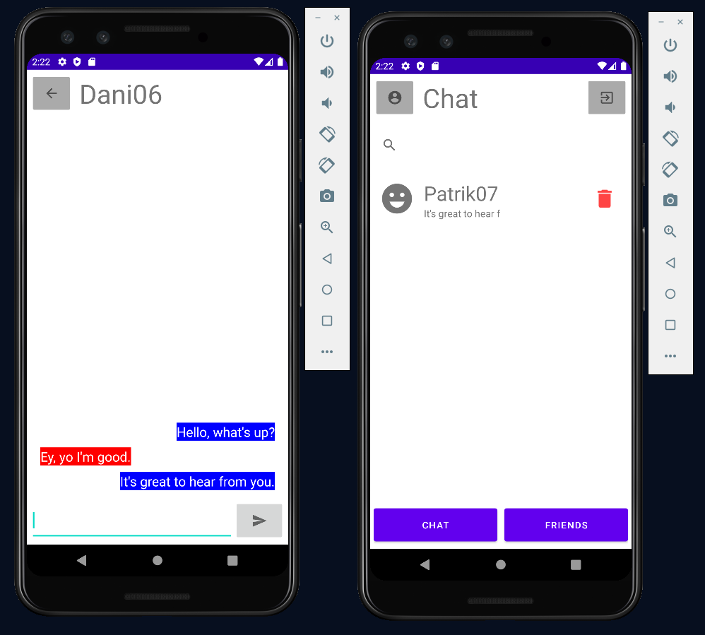

# AndroidChatApp
 

## Description
Native android app with Kotlin. It has all the expected chat app functionality. I used Firebase for the authentication, stroing information about users and for the chat function of course.

## Note
I know the UI/UX is bad. :(
